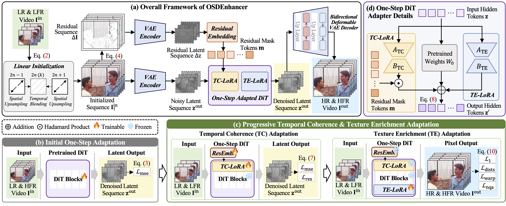

# Taming Real-World Space-Time Video Super-Resolution with One-Step Diffusion (arXiv 2026)

**Authors**: [Shuoyan Wei](https://github.com/W-Shuoyan)<sup>1</sup>, [Feng Li](https://lifengcs.github.io/)<sup>2,\*</sup>, Chen Zhou<sup>1</sup>, [Runmin Cong](https://rmcong.github.io)<sup>3</sup>, [Yao Zhao](https://scholar.google.com/citations?user=474TbQYAAAAJ&hl=en&oi=ao)<sup>1</sup>, [Huihui Bai](https://scholar.google.com/citations?user=iXuCUcQAAAAJ&hl=en&oi=ao)<sup>1</sup>

<sup>1</sup>*Beijing Jiaotong University*, <sup>2</sup>*Hefei University of Technology*, <sup>3</sup>*Shandong University*

<small><sup>\*</sup>Corresponding Author</small>

[](https://arxiv.org/abs/2601.20308)
[](https://huggingface.co/W-Shuoyan/OSDEnhancer)
[](https://github.com/W-Shuoyan/OSDEnhancer)

This repository contains the reference code for the paper "[**Taming Real-World Space-Time Video Super-Resolution with One-Step Diffusion**](https://arxiv.org/pdf/2601.20308)".

---




**In this paper, we propose OSDEnhancer, the first framework that achieves real-world STVSR in one-step diffusion.** Given a low-resolution and low-frame-rate video as input, OSDEnhancer generates a high-resolution and high-frame-rate video.

OSDEnhancer begins with a linear initialization to establish essential spatiotemporal structures and adapt the model for one-step reconstruction. It then applies a divide-and-conquer strategy, introducing the temporal coherence (TC) and texture enrichment (TE) LoRAs that progressively specialize in inter-frame dynamics modeling and fine-grained texture recovery, respectively, while collaborating during inference for enhanced overall performance. A bidirectional VAE decoder employs deformable recurrent blocks to leverage the multi-scale structure of the vanilla VAE, enhancing latent-to-pixel reconstruction through joint multi-scale deformable aggregation and inter-frame feature propagation.

## 🔈News

- ✅ **[May 2026]** The inference code and pretrained checkpoints are now available 👉 [](https://github.com/W-Shuoyan/OSDEnhancer) [](https://huggingface.co/W-Shuoyan/OSDEnhancer)
- ✅ **[Jan 2026]** The arXiv version of our paper has been released 👉 [](https://arxiv.org/abs/2601.20308)


## 📚 Installation

```shell
git clone https://github.com/W-Shuoyan/OSDEnhancer.git
cd OSDEnhancer
conda create -n OSDEnhancer python=3.10
conda activate OSDEnhancer
pip install torch==2.8.0+cu128 torchvision==0.23.0+cu128 --index-url https://download.pytorch.org/whl/cu128
pip install -r requirements.txt
```

## 🚀 Usage

### Pretrained Checkpoints
Download the pretrained checkpoint below.
| Model Name| Base Model | Download Link 🔗|
|---|---|---|
| OSDEnhancer-v1.0 | [CogVideoX1.5-5B](https://huggingface.co/zai-org/CogVideoX1.5-5B) | [🤗 Hugging Face](https://huggingface.co/W-Shuoyan/OSDEnhancer) |


The checkpoint directory should be organized as follows:
```text
ckpt/
├── transformer/
│   ├── config.json
│   ├── diffusion_pytorch_model-00001-of-00002.safetensors
│   ├── diffusion_pytorch_model-00002-of-00002.safetensors
│   └── diffusion_pytorch_model.safetensors.index.json
├── vae/
│   ├── config.json
│   └── diffusion_pytorch_model.safetensors
├── scheduler/
│   └── scheduler_config.json
└── prompt_embeddings/
    └── empty.safetensors
```

### Inference

Run OSDEnhancer on an input video:

```bash
python inference.py \
  --input demo/input.mp4 \      # Path to the input MP4 video
  --output demo/output.mp4 \    # Path to save the enhanced MP4 video
  --ckpt_path ckpt \            # Path to the pretrained checkpoint directory
  --spatial_scale 4 \           # Spatial upsampling scale
  --temporal_scale 2            # Temporal upsampling scale
```
We recommend setting `spatial_scale = 4` and `temporal_scale = 2`. For long videos or high-resolution inputs, enable chunk-based inference by additionally setting `--chunk_num` and `--overlap`, where `--chunk_num` should satisfy the form of `8N+1`.

## 📧 Contact

If you meet any problems, please feel free to contact us via email: shuoyan.wei@bjtu.edu.cn

## 💡 Cite

If you find this work useful for your research, please consider citing our paper 😊

```shell
@article{wei2026osdenhancer,
  title={Taming Real-World Space-Time Video Super-Resolution with One-Step Diffusion},
  author={Wei, Shuoyan and Li, Feng and Zhou, Chen and Cong, Runmin and Zhao, Yao and Bai, Huihui},
  journal={arXiv preprint arXiv:2601.20308},
  year={2026}
}
```

## 📕 License & Acknowledgement

This project is released under the Apache License 2.0. OSDEnhancer is built upon [CogVideoX](https://github.com/zai-org/CogVideo). We also sincerely thank the authors of [DOVE](https://github.com/zhengchen1999/DOVE), [EvEnhancer](https://github.com/W-Shuoyan/EvEnhancer), and [RealBasicVSR](https://github.com/ckkelvinchan/realbasicvsr) for their excellent open-source implementations, which provided valuable references for this project.
